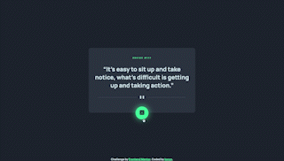

# Frontend Mentor - Advice generator app solution

This is a solution to the [Advice generator app challenge on Frontend Mentor](https://www.frontendmentor.io/challenges/advice-generator-app-QdUG-13db). Frontend Mentor challenges help you improve your coding skills by building realistic projects.

## Table of contents

- [Overview](#overview)
  - [The challenge](#the-challenge)
  - [Screenshot](#screenshot)
  - [Links](#links)
- [My process](#my-process)
  - [Built with](#built-with)
  - [What I learned](#what-i-learned)
- [Author](#author)

## Overview

### The challenge

Users should be able to:

- View the optimal layout for the app depending on their device's screen size
- See hover states for all interactive elements on the page
- Generate a new piece of advice by clicking the dice icon

### Screenshot

#### Screensize 1440px - Desktop



#### Screensize 375px - Mobile


### Links

- View my Solution on [Frontend Mentor](https://your-solution-url.com)
- View the Live Site [here](https://your-live-site-url.com)

## My process

- HTML semantics
- Importing Google Fonts
- Set variables
- Reset default settings
- Styles (Mobile First)
- JavaScript

### Built with

- JavaScript
- SASS custom properties
- CSS Grid
- CSS Flexbox
- Mobile-first workflow
- Google Fonts - For Fonts
- Semantic HTML5 markup

### What I learned

This challenge gave me the opportunity to do some homework about API's and the fetch() method in JavaScript. Writing down what I have learned helps to give me a clear understanding about the subject. So here it goes!

"Application Programming Interfaces", or "API's" essentially provide a doorway in the form of code that enables access for two unrelated applications to communicate & share information with eachother.

For this challenge I made use of a browser API and a third party API. The former is the "Fetch API" and the latter is the "Advice Slip API", a web service made by Tom Kiss.

Examples of browser API's:

- Canvas API
- Fullscreen API
- Clipboard API
- Payment Request API
- Geolocation API

Examples of third party API's:

- Google Analytics
- Google Maps
- Facebook Login
- YouTube
- PayPal

API's are an empowering tool for developers and engineers, because it enables them to acquire (real-time) data via an API "CALL', or “request”.

For this challenge I've used the fetch() method. I made a GET request by passing in the URL endpoint as an argument:

```js
fetch("https://api.adviceslip.com/advice");
```

The fetch() method returns a Promise Object. To explain this in layman's terms; a Promise Object represents an operation in which the value of the return currently is unknown, included with the guarantee that the value will be known at some point. A Promise has three possible states:

- Pending
- Fulfilled
- Rejected

Once the Promise has been called it initially starts in a "Pending" state. You can use the .then and .catch method to handle the Promise once it's in a "Fulfilled" or a "Failed" state.

The Advice Generator App functions well in Google Chrome, but in FireFox there is a delay and a repeat of the same advice.

## Author

- Frontend Mentor - [@kxnzx](https://www.frontendmentor.io/profile/kxnzx)
